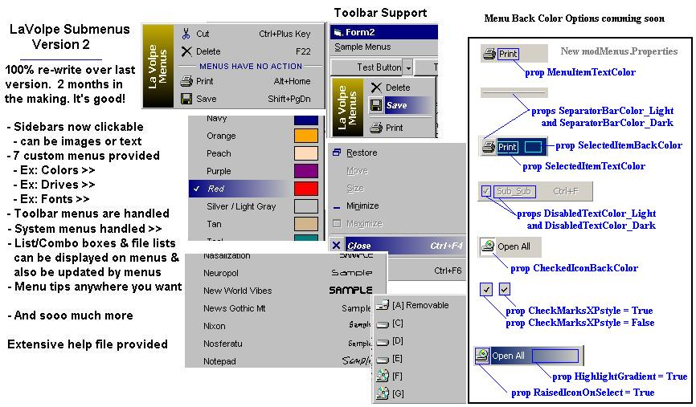



## LaVolpe Submenus v2

### Description

9,000 hits indicates you liked 1st version. Then, you'll absolutely love this new one. Complete rewrite fixing all known issues w/previous version and adding way too much to this iteration. ScreenShot hilites a lot of it. So heavily remarked it makes up 1/3 of the file size; a 250+kb html help file with pics, a fair sample project and something unique -- an optional user control you can add to your project while in IDE to view menus as they would look in run-time. Has its limitations, but works well.   I'm looking for honest feedback, especially pertaining to bugs experienced on your system; this has been tested to death on Win98 & Win2K. I have been testing this for several weeks and each bug found, it seems I added a new feature. Figured if I didn't put this out now, I'd never put it out. Gotta stop sometime to smell the roses. Unzip the help file images to a folder named "ReadMe_files" then put the readme.html in the folder above that.   P.S. honest feedback and the "pat on the back" votes keep us going. Thank you in advance.   Last updated: 12 Mar/4:15PM Eastern.
 
### More Info
 

             |
---                |---
**Submitted On**   |2003-03-12 15:30:58
**By**             |[LaVolpe](https://github.com/Planet-Source-Code/PSCIndex/blob/master/ByAuthor/lavolpe.md)
**Level**          |Advanced
**User Rating**    |5.0 (571 globes from 115 users)
**Compatibility**  |VB 6\.0
**Category**       |[Graphics](https://github.com/Planet-Source-Code/PSCIndex/blob/master/ByCategory/graphics__1-46.md)
**World**          |[Visual Basic](https://github.com/Planet-Source-Code/PSCIndex/blob/master/ByWorld/visual-basic.md)
**Archive File**   |[LaVolpe\_Su1558383122003\.zip](https://github.com/Planet-Source-Code/lavolpe-lavolpe-submenus-v2__1-43638/archive/master.zip)

### API Declarations

User32, GDI32, Shell32, Kernel32, and a couple more.

